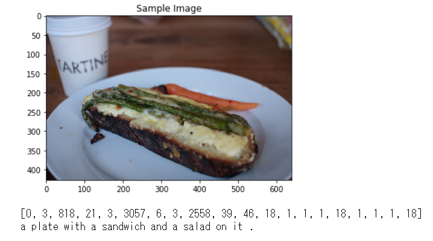
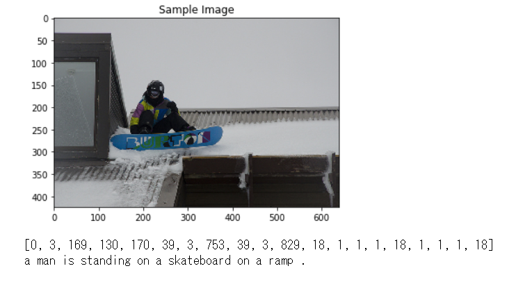
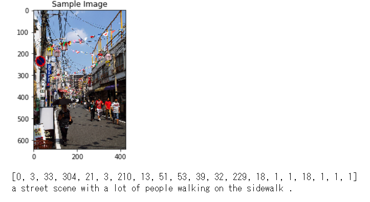

# Image Captioning 

This is an excercise of Image Captioning, as a part of Udacity Comuputer Vision Nanodegree Program.

## What is Image Captioning? 

Image captioning is to attach a short descriptiong sentence to a image. This tries to automatically generate the sentence by loading images. 

## Dataset Used

Used COCO dataset  (http://cocodataset.org)

## Network Structure 

The network is as below. This is an encoder-decoder structure. Encoder part is a pre-trained CNN(ResNet), and provides an embedded vector that decribes the features of images. 
Decoder part is RNN (LSTM) and transforms the features into word vector.
 

## Some Results 

This simple network surprisingly works well. 

